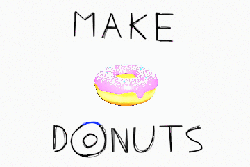

# breakbeet

A silly music visualizer that sizes a 3D model according to the volume of the input audio.

## Motivation
It started as a joke inspired by [Breakmaster Cylinder's 2016 Update (Reply All Ep. 84)](https://soundcloud.com/breakmaster-cylinder/breakmaster-cylinders-2016-update-reply-all-ep-84), but was eventually generalized to accept arbitrary models and sounds. It's now a niche animation tool to animate a 3D model sized according to audio.

## Usage
This project is currently available at [breakbeet.com](https://breakbeet.com). Experimentation is highly encouraged.

The default scene is a low poly beetroot animated to a short drum pattern, but you can provide your own 3D model (in GLB / gLTF format) and music (or use microphone input). For example, here is an edited screen capture of me reading "make donuts" into my microphone to animate my [Blender Donut](https://www.reddit.com/r/BlenderDoughnuts). The original shot is chroma key'd and composited on top of another animation created in Blender Grease Pencil.

This shows that you can make a really simple animation controlled by your voice.

From the settings panel, you can select a different audio file to use. If your desired audio is streamed, you can install a Virtual Audio Device (for [example](https://www.dxzone.com/5-free-virtual-audio-cable-software/), I use [Blackhole](https://github.com/ExistentialAudio/BlackHole)) to loopback system audio to your microphone.

You can also select a different 3D model to use from the settings panel. This project currently only accepts GLB / gLTF models so all other file formats should be converted to gLTF in order to be used. If you aren't exporting from a modelling tool, there are several free online converters (such as the [BlackThread.io gLTF converter](https://blackthread.io/gltf-converter/)).

The controls are purposely hidden and a background color selector is provided to make the background easy to chroma key out.

For more examples, check out some of the clips I put on [YouTube](https://www.youtube.com/playlist?list=PLs_0Nv-YQkoCrw4O8oCQoY7Eow-vmqNQB):

## Technology
All processing is done locally in the browser using the [Web Audio API](https://www.w3.org/TR/webaudio) and [three.js](https://threejs.org). None of the user provided models or audio is uploaded anywhere. This project is hosted on [GitHub Pages](https://pages.github.com).

## License
Distributed under the MIT License. See [LICENSE](LICENSE) for more information.

All assets in this repository are original with a few exceptions:
* The [GitHub Logo](assets/images/GitHub-Mark-32px.png) is owned by [GitHub, Inc.](https://github.com/logos)
* The [Amen Break](assets/audio/amen_break_rendition.mp3) rendition is self-arranged, but the original beat is by [the Winstons](https://en.wikipedia.org/wiki/Amen_break).
* The [example donut GIF](assets/images/make_donuts.gif) is modelled and composited by me, but the original donut design is by [Blender Guru](https://www.blenderguru.com/tutorials/blender-beginner-tutorial-series).

## Contact

I would love to see the things you are doing with this project.

If there are any problems, please raise an issue on GitHub.
